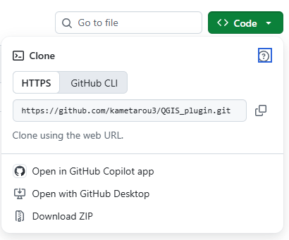
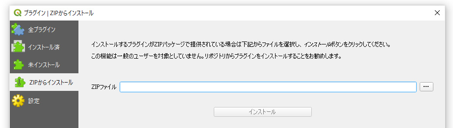
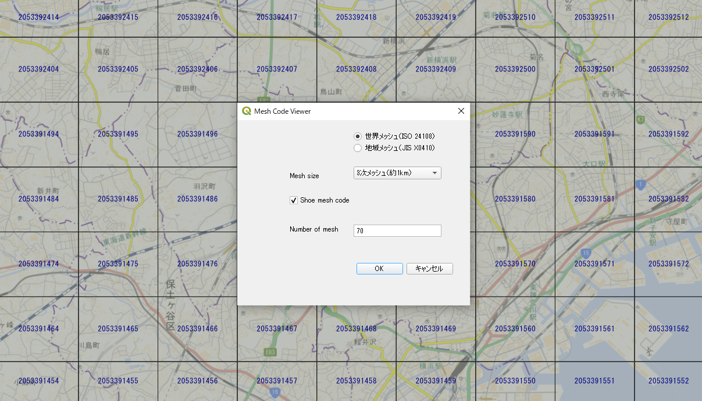
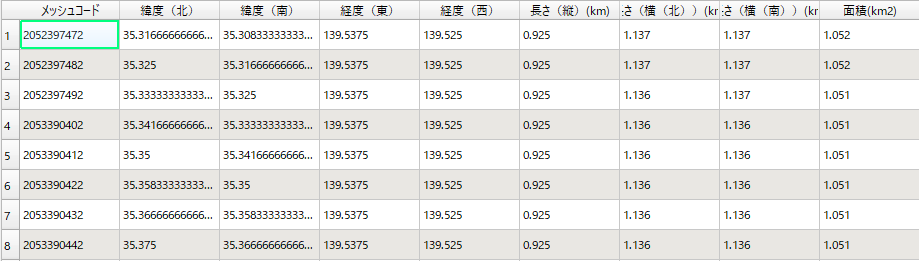

# プロジェクト名

mesh_code_viewer
mesh_code_viewerは、QGISのプラグインです。
地理院地図、OpenStreetMapなどの背景地図に、世界メッシュ（ISO 24108）または地域メッシュ（JIS X 0410）を作成し、メッシュコードを表示します。

## 特徴

- QGISのプラグインで動作します。
- 背景地図の表示範囲に背景地図に、世界メッシュ（ISO 24108）または地域メッシュ（JIS X 0410）を表示します。
- 世界メッシュコード（ISO 24108）または地域メッシュコード(JIS X 0410)を表示します。

## 動作環境

- QGIS 3.28、3.44で動作確認。
- 背景地図　地理院地図、OpenStreetMap（EPSG:3857）で動作確認。

## インストール

右上の<>CodeのDownload ZIPを選択してファイルをzip形式でダウンロードしてください。

QGIS プラグイン > プラグインの管理とインストール...を開き、ZIPからインストールを選択して、ファイルを指定してインストールしてください。

## 使い方

- 世界メッシュ（ISO 24108）または地域メッシュ（JIS X 0410）を選択します。
- mesh sizeを選択します。
- show mesh codeでメッシュコードの表示/非表示を選択します。
- OKボタンを押します。
- 表示メッシュ数は100を限界値に設定しています。
- 属性データには、メッシュコード、緯度（北）、緯度（南）、経度（東）、経度（西）、長さ（縦）、長さ（横（北））、長さ（横（南））、面積を表示します。

地理院地図を背景地図に利用。

## ライセンス

世界メッシュコードの原著作者は横浜市立大学データサイエンス学部佐藤彰洋教授（一般社団法人世界メッシュ研究所代表理事）です。